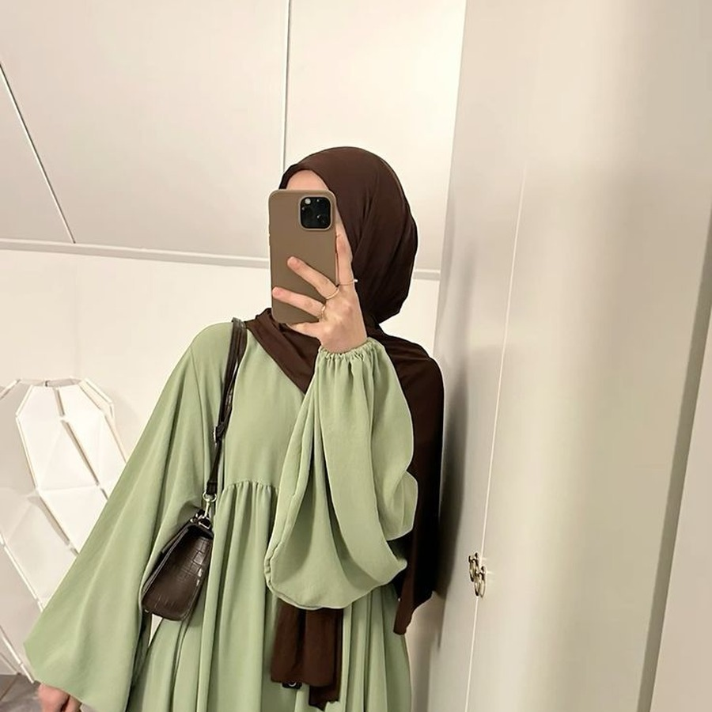

# 👋 Hi, I'm Iram Shahzadi

 

---

## 🎓 About Me

- 🎓 3rd Semester Data Science Student
- 🐍 Currently learning **Python** and **Pandas**
- 📊 Exploring **Data Analysis** and **Data Visualization**
- 🌱 Building my foundation in **Data Science**
- 💻 Learning **Git** and **GitHub**
- 🚀 Working towards becoming a **Data Scientist**

---

## 🧠 Current Learning Journey

<table>
<tr>
<td width="50%">

### 🐍 Python

- Variables and Data Types
- Functions
- Loops and Conditions
- File Handling
- Problem Solving

</td>
<td width="50%">

### 📊 Pandas

- DataFrames
- CSV Files
- Data Cleaning
- Filtering
- Basic Analysis

</td>
</tr>
<tr>
<td width="50%">

### 🔢 NumPy

- Arrays
- Mathematical Operations
- Indexing and Slicing
- Statistics Functions

</td>
<td width="50%">

### 🔧 Tools

- VS Code
- Git
- GitHub
- Jupyter Notebook

</td>
</tr>
</table>

---

## 🚀 Current Roadmap

| Status | Topic |
|---|---|
| ✅ Completed | Python Basics |
| ✅ Completed | Git & GitHub Basics |
| 🔄 In Progress | Pandas |
| 🔄 In Progress | NumPy |
| ⏳ Upcoming | Data Visualization |
| ⏳ Upcoming | Machine Learning |
| ⏳ Upcoming | Deep Learning |

---

## 🛠 Tech Stack

### Languages

### Libraries

### Tools

---

## 📂 Current Projects

### 📊 Exploratory Data Analysis

- Data Cleaning
- Missing Value Handling
- Basic Visualization
- Finding Insights

### 📁 CSV File Processing

- Reading CSV files
- Data Transformation
- Data Analysis using Pandas

### 📈 Data Analysis Projects

- Real-world datasets
- Basic insights
- Simple charts and reports

---

## 🎯 Goals for 2026

- Build **10+ Data Science Projects**
- Master **Pandas** and **NumPy**
- Learn **Machine Learning**
- Participate in **Kaggle Competitions**
- Build a strong **Data Science Portfolio**

---

## 📈 GitHub Stats

---

## 🌐 Connect With Me

- 🐙 GitHub: [eramshahzadi](https://github.com/eramshahzadi)
- 💼 LinkedIn: [iramshahzadi-python](https://www.linkedin.com/in/iramshahzadi-python/)

---

### ⭐ "Every expert was once a beginner."

### 🚀 Learning • Building • Growing

